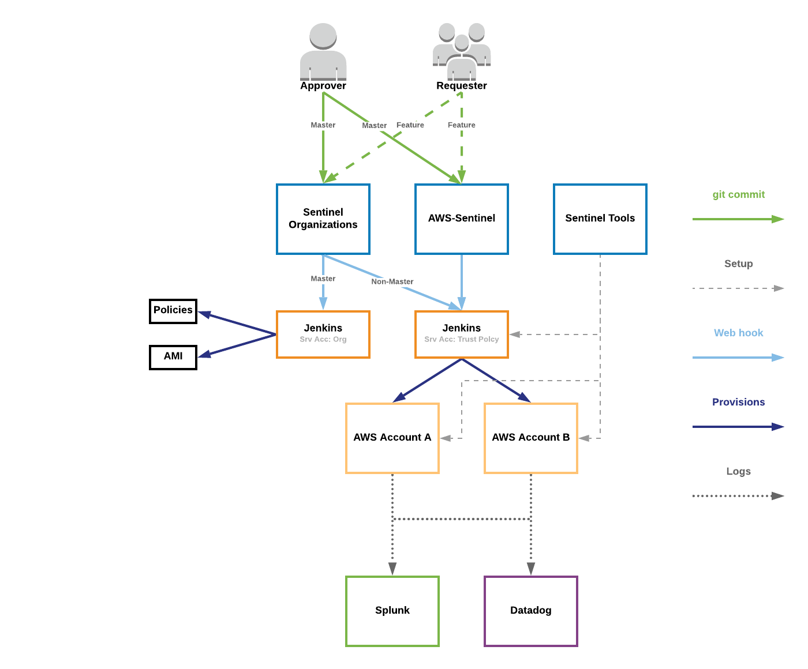

# aws-sentinel


## Overview

This repository uses [terraform](https://www.terraform.io/) to define the accounts & resources needed to:

* Enable logging to Splunk
* Create AWS Config rules to verify compliance

## Workflow

### CI/CD

Commits on to:
* Any branch will trigger a `terraform plan` in Jenkins.
* If the branch is `master` a `terraform apply` will also be run, applying said changes.

### Git

With that in mind, the work-flow would be:

1. Create a new branch
2. Commit changes to the new branch
3. Verify "plan" does what you've intended (If not, return to step 2)
4. Submit a Pull Request to `master`

Then the **Approver** will:

5. Review config changes & "plan". (If more changes are needed return to step 2)
6. Merge pull request.

Then **Jenkins** will:

7. Apply Changes to accounts (see "Trouble shooting" if this fails)
8. 🥳

### Workflow Diagram
This repository is the AWS-Sentinel repository in the diagram below.


## Adding an Account

### Prereqs

* Verify that the the Jenkins server will have the ability to assume the role `aws-sentinel-assumed-role` in the new account.
* The account must have a config recorder created in the region you'd like to deploy to.

### Steps

1. Create a role named `aws-sentinel-assumed-role` in the target account. To do this via cli, in the target account run:

   ```bash
   aws iam create-role \
       --role-name aws-sentinel-assumed-role \
       --assume-role-policy-document file://policies/aws-sentinel-assumed-role-trust-policy.json
   ```

2. Add policies in `./policies/modules/*` to the newly created role.  To do this via cli, for each file in `./policies/modules/` do the following:

   1. Create the policy (substituting `<POLICY-FILE-NAME>` for the file name):

       ```bash
       aws iam create-policy \
           --policy-name aws-sentinel-assumed-role-policy \
           --policy-document file://policies/modules/<POLICY-FILE-NAME> \
           --query Policy.Arn \
           --output text
       ```

   2. Attach the policy (substituting `<POLICY-ARN>` with the arn of the policy created above):

       ```bash
       aws iam attach-role-policy \
           --role-name aws-sentinel-assumed-role \
           --policy-arn <POLICY-ARN>
       ```


3. Add the following module definition to `main.tf` on the `master` branch (it's recommended to make this change on a separate branch, then merge via a pull request):

   ```hcl
   module "<NEW-ACCOUNT-NAME>" {
   	####  TODO   ####
   }
   ```
4. Verify the Job runs successfully in Jenkins.


## Deleting an Account

### Steps

1. In the `main.tf` definition for the account you'd like to remove, set `enabled = false` on the `master` branch (it's recommended to make this change on a separate branch, then merge via a pull request). 
For example:

   ```hcl
   module "<ACCOUNT-NAME>" {
   	####  TODO   ####
   	enabled = false
   }
   ```
   **Note:** See "Permission Denied/Unauthorized to Perform Action", in the Troubleshooting section if this job fails.

2. (Optionally) After the change above is applied successfully, you can safely remove the `module` definition entirely.

## Modules

### Root Module

The root module simply contains a call to the `managed_account` module for each of the accounts which resources are to be created in.  The module definitions would like something like:

```hcl
module "my_managed_account" {
  source   = "./modules/managed_account"
  role_arn = "<role-to-assume>"
}
```

### For other modules see:
* `modules/managed_accounts` (a good place to start!)
* `modules/aws-splunk-integration`
* `modules/config_rules`
* `modules/sqs-`

## Trouble Shooting

This is a list of some errors you _may_ run into and possible solutions for them.

### "Error: Provider configuration not present"

This is caused by removing a `managed_account` module from the root modules `main.tf` without first disabling it.  A possible solution to this issue is:

1. Re-add the `managed_account`  module to `main.tf`, but specify `enabled = false`.  (Note: This will need to be done on the `master` branch so the changes are actually applied.)
2. Once the changed in step 1. are applied, you can safely remove the module.

### "Error acquiring the state lock: ..."

This error occurs when the `terraform plan` or the `terraform apply` is unable to acquire the lock usually because some other process.  E.g. two commits are trying to run `terraform plan` at the _same time_.  If this is the case, simply wait until other jobs have finished then rerun the failed job.

### Permission Denied/Unauthorized to Perform Action
Some resources may fail to be deleted due to permission errors, this can be resolved by either deleting said resources manually or by granting the Jenkins Server permission to delete said resources; then rerunning the job.

As of now the resources with known-issues are:
* AWS Config rules (Due to SCP rule)
* VPC Flowlogs

## TODO
* Break out the modules into separate repositories.
