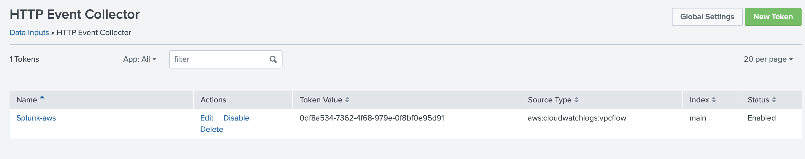

# aws-splunk-integration Module

## Diagram

## Resources
1. Trumpet resources including:
   1. Kinesis Firehose
   2. cloudwatch subscriptions for each resource captured in cloudwatch loggroups.
2. Flowlogs and cloudwatch loggroup for VPCs in each account (region us-east-1).

## Description
This module implements two cloudformation scripts. One for implementing
flowlogs, and the other to implement the resources created by Trumpet.

## Variables
1. __enable\_flowlog__ - Used to enable the execution of the flowlog cloudformation stack.
2. __enabled__ - Used to enable this module for the account.
3. __log\_group\_name__ - The name of the cloudwatch log group for collecting flowlogs.

__NOTE__: The flowlog group name needs to be the same as the name in the trumpet script.
4. __division__ - The name used to select the trumpet script to run.

## Generating Trumpet Script
The trumpet script needs to be generated with the same log group name used in the `log_group_name` variable.

The trumpet script is generated using the trumpet template generated used for the S&P organization.
An example of the interface is shown below.

## Splunk Integration
On the splunk side an HEC needs to be implemented with an access token and endpoint.
An example setup in splunk is shown below.

