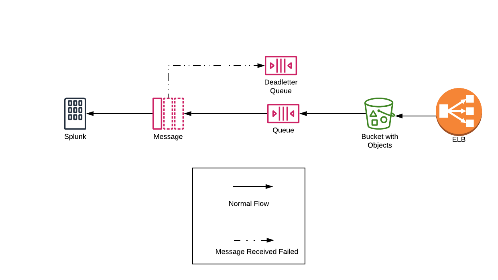
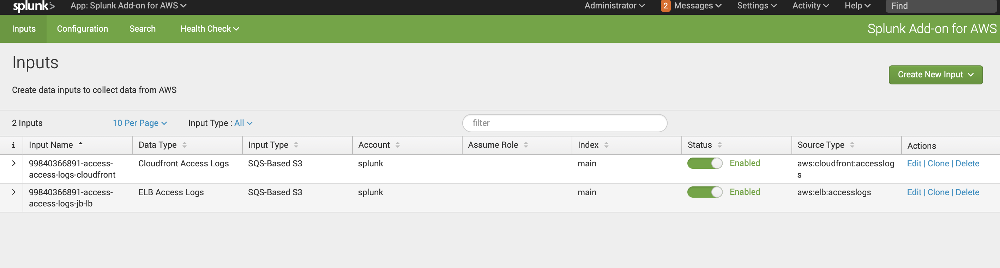

# S3-SQS Module

## Diagram

## Resources
1. __sqs\_queue__ - This is the SQS queue in which splunk should subscribe to.
2. __sqs\_queue\_deadletter__ - This is a dead letter queue that works in
conjunction with the reqular queue.
3. __s3\_bucket\_notification__ - This is a notification  resource that is placed onto
the S3 bucket used to store the ELB or cloudfron access logs.

## Description
This module sets up the necessary AWS resources to ingest ELB 
and Cloudfront logs into splunk.

## Variables
1. __bucket\_names__ - The list of buckets that will forward data to the sqs queue.
2. __elb_account\_id__ - The ELB account id to use for the region. A list of AWS ELB account
ids per region can be found: 
https://docs.aws.amazon.com/elasticloadbalancing/latest/application//load-balancer-access-logs.html.
3. __enabled__ - Enables flag used for all modules in an account.
4. __enable\_sqs__ - Enables this module.
## Splunk Integration
On the splunk side the SQS-Based S3 needs to be setup like shown. This can be implemented using ansible.

